# 라이브러리 컴퍼니 데이터 분석 대시보드

극장과 콘서트 관련 데이터를 시각화하고 분석하는 웹 애플리케이션입니다.

## 배포된 사이트

- **프로덕션**: https://librarycompany-data-analysis-dashboard-2p72m151q.vercel.app
- **관리 페이지**: https://vercel.com/jwlees-projects-85d7d315/librarycompany-data-analysis-dashboard

## 빠른 시작

### 1. 프로젝트 클론 및 설치

```bash
# 프로젝트 클론
git clone [repository-url]
cd library_company_data_analysis_custom_website

# 의존성 설치
npm install
```

### 2. 로컬 개발 서버 실행

```bash
npm run dev
```

브라우저에서 [http://localhost:3000](http://localhost:3000)으로 접속하여 확인할 수 있습니다.

## 기술 스택

- **Framework**: Next.js 15.3.3 (App Router)
- **Language**: TypeScript
- **Styling**: Tailwind CSS 4
- **Charts**: Chart.js + React-Chart.js-2
- **Animation**: Framer Motion
- **Icons**: Lucide React, React Icons
- **UI Components**: Radix UI
- **Deployment**: Vercel

## 시스템 전체 구조

```mermaid
graph TB
    subgraph "사용자 환경"
        User["사용자<br/>브라우저"]
    end
    
    subgraph "Vercel 클라우드"
        subgraph "프론트엔드 (Next.js 15.3.3)"
            WebApp["웹 애플리케이션<br/>localhost:3000"]
            
            subgraph "페이지들"
                Home["홈페이지<br/>(/"]
                Dashboard["대시보드<br/>(/dashboard)"]
                
                subgraph "연극 & 뮤지컬"
                    PlayTotal["총 매출 현황<br/>(/play/total-sales)"]
                    PlayCast["캐스트 수익<br/>(/play/cast-revenue)"]
                    PlayDaily["일일 판매<br/>(/play/daily-sales)"]
                    PlayWeekly["주간 수익<br/>(/play/weekly-revenue)"]
                    PlayMonthly["월간 수익<br/>(/play/monthly-revenue)"]
                    PlayPeriod["기간별 수익<br/>(/play/period-revenue)"]
                    PlayTickets["주간 티켓<br/>(/play/weekly-tickets)"]
                end
                
                subgraph "콘서트"
                    ConcertTotal["전체 현황<br/>(/concert/total-status)"]
                    ConcertIndiv["개별 현황<br/>(/concert/individual-status)"]
                end
            end
            
            subgraph "API Routes (프록시)"
                APIProxy["API 프록시<br/>(/api/*)"]
                
                subgraph "Play APIs"
                    PlayAPI1["/api/play/summary"]
                    PlayAPI2["/api/play/monthly-summary"]
                    PlayAPI3["/api/play/cast-revenue"]
                    PlayAPI4["/api/play/all-showtime"]
                    PlayAPI5["/api/play/revenue-analysis"]
                    PlayAPI6["/api/play/monthly-by-performance"]
                    PlayAPI7["/api/play/weekly-overview"]
                    PlayAPI8["/api/play/daily-details"]
                    PlayAPI9["/api/play/occupancy-rate"]
                end
                
                subgraph "Concert APIs"
                    ConcertAPI1["/api/concert/overview"]
                    ConcertAPI2["/api/concert/daily"]
                    ConcertAPI3["/api/concert/weekly"]
                    ConcertAPI4["/api/concert/monthly"]
                    ConcertAPI5["/api/concert/target-sales"]
                    ConcertAPI6["/api/concert/bep"]
                    ConcertAPI7["/api/concert/estimated-profit"]
                    ConcertAPI8["/api/concert/marketing-calendar"]
                end
            end
        end
        
        subgraph "배포 환경"
            Prod["프로덕션<br/>librarycompany-data-analysis-dashboard"]
            VercelDash["Vercel 대시보드<br/>관리 및 모니터링"]
        end
    end
    
    subgraph "백엔드 서버"
        subgraph "개발 환경"
            BackendDev["개발 서버<br/>localhost:3001"]
        end
        
        subgraph "운영 환경"
            BackendProd["운영 서버<br/>35.208.29.100:3001"]
        end
        
        subgraph "데이터베이스"
            DB["데이터베이스<br/>콘서트 & 연극 데이터"]
        end
    end
    
    subgraph "개발 도구"
        Git["Git Repository<br/>소스 코드 관리"]
        DevTools["개발 도구<br/>TypeScript, Tailwind CSS<br/>Chart.js, Framer Motion"]
    end
    
    %% 사용자 플로우
    User --> WebApp
    WebApp --> Dashboard
    Dashboard --> PlayTotal
    Dashboard --> ConcertTotal
    
    %% API 호출 플로우
    PlayTotal --> APIProxy
    ConcertTotal --> APIProxy
    
    %% 프록시 → 백엔드
    PlayAPI1 --> BackendDev
    PlayAPI1 --> BackendProd
    ConcertAPI1 --> BackendDev
    ConcertAPI1 --> BackendProd
    
    %% 백엔드 → 데이터베이스
    BackendDev --> DB
    BackendProd --> DB
    
    %% 배포 플로우
    Git --> Prod
    WebApp --> Prod
    
    %% 관리
    VercelDash --> Prod
    
    %% 스타일링
    classDef userClass fill:#e1f5fe,stroke:#0288d1,stroke-width:2px
    classDef frontendClass fill:#f3e5f5,stroke:#7b1fa2,stroke-width:2px
    classDef backendClass fill:#e8f5e8,stroke:#388e3c,stroke-width:2px
    classDef dbClass fill:#fff3e0,stroke:#f57c00,stroke-width:2px
    classDef devClass fill:#fce4ec,stroke:#c2185b,stroke-width:2px
    classDef prodClass fill:#f1f8e9,stroke:#689f38,stroke-width:2px
    
    class User userClass
    class WebApp,Dashboard,PlayTotal,ConcertTotal frontendClass
    class APIProxy,PlayAPI1,PlayAPI2,PlayAPI3,PlayAPI4,PlayAPI5,PlayAPI6,PlayAPI7,PlayAPI8,PlayAPI9 frontendClass
    class ConcertAPI1,ConcertAPI2,ConcertAPI3,ConcertAPI4,ConcertAPI5,ConcertAPI6,ConcertAPI7,ConcertAPI8 frontendClass
    class BackendDev,BackendProd backendClass
    class DB dbClass
    class Git,DevTools devClass
    class Prod,VercelDash prodClass
```



### 시스템 구성 요소 설명

#### 색상 구분
- **파란색**: 사용자 환경
- **보라색**: 프론트엔드 (Next.js 애플리케이션)
- **초록색**: 백엔드 서버
- **주황색**: 데이터베이스
- **분홍색**: 개발 도구
- **연두색**: 배포 및 운영 환경

#### 데이터 플로우
1. **사용자 접근**: 브라우저 → 웹 애플리케이션
2. **페이지 네비게이션**: 대시보드 → 각 섹션별 페이지
3. **API 호출**: 페이지 → API Routes (프록시)
4. **데이터 요청**: API Routes → 백엔드 서버 (개발/운영)
5. **데이터 응답**: 백엔드 서버 → 데이터베이스

#### 배포 플로우
- **소스 코드**: Git Repository → Vercel 자동 배포
- **환경 관리**: 개발 환경 (localhost:3001) ↔ 운영 환경 (35.208.29.100:3001)
- **모니터링**: Vercel 대시보드를 통한 실시간 관리

## 프로젝트 구조

```
src/
├── app/
│   ├── api/                # API Routes (프록시)
│   │   ├── concert/        # 콘서트 API 엔드포인트들
│   │   └── play/           # 연극 & 뮤지컬 API 엔드포인트들
│   ├── dashboard/           # 대시보드 메인
│   │   ├── play/           # 연극 & 뮤지컬 관련 페이지들
│   │   │   ├── cast-revenue/      # 캐스트 수익 분석
│   │   │   ├── daily-sales/       # 일일 판매 현황
│   │   │   ├── weekly-revenue/    # 주간 수익 분석
│   │   │   ├── monthly-revenue/   # 월간 수익 분석
│   │   │   ├── period-revenue/    # 기간별 수익 비교
│   │   │   ├── weekly-tickets/    # 주간 티켓 판매
│   │   │   └── total-sales/       # 총 매출 현황 (통합)
│   │   └── concert/        # 콘서트 관련 페이지들
│   │       ├── individual-status/ # 개별 콘서트 상태
│   │       └── total-status/      # 전체 콘서트 현황
│   ├── page.tsx            # 홈페이지
│   └── layout.tsx          # 루트 레이아웃
├── components/
│   ├── dashboard/          # 대시보드 컴포넌트들
│   │   ├── Sidebar.tsx     # 사이드바 네비게이션
│   │   ├── Header.tsx      # 헤더
│   │   ├── Footer.tsx      # 푸터
│   │   ├── concert/        # 콘서트 관련 컴포넌트들
│   │   ├── play/           # 연극 & 뮤지컬 관련 컴포넌트들
│   │   ├── *Chart.tsx      # 각종 차트 컴포넌트들
│   │   ├── *Table.tsx      # 테이블 컴포넌트들
│   │   └── *Card.tsx       # 카드 컴포넌트들
│   ├── debug/              # 디버깅용 컴포넌트들
│   └── ui/                 # 재사용 가능한 UI 컴포넌트들
├── hooks/                  # 커스텀 React 훅들
│   ├── useApiData.ts       # API 데이터 관리 훅
│   ├── useConcertApi.ts    # 콘서트 API 훅
│   └── usePlayApi.ts       # 연극 & 뮤지컬 API 훅
└── lib/
    ├── api.ts              # API 관련 타입 및 클래스
    └── utils.ts            # 유틸리티 함수들
```

## 주요 기능

### 연극 & 뮤지컬 데이터 분석
- 통합 매출 현황 (연극/뮤지컬 구분)
- 공연별 상세 매출 분석
- 유료 점유율 현황 모니터링
- 캐스트별 수익 분석
- 일일/주간/월간 수익 데이터
- 기간별 성과 비교

### 콘서트 데이터 분석
- 개별 콘서트 상태 모니터링
- 전체 콘서트 현황 대시보드

### 데이터 시각화
- Chart.js를 활용한 다양한 차트
- 반응형 테이블
- 인터랙티브 대시보드

### API 통합
- Next.js API Routes를 통한 프록시 구조
- 외부 API와의 안전한 연동
- 실시간 데이터 업데이트
- 에러 핸들링 및 로딩 상태 관리

## 개발 명령어

```bash
# 개발 서버 실행 (Turbopack 사용)
npm run dev

# 프로덕션 빌드
npm run build

# 프로덕션 서버 실행
npm start

# 린팅
npm run lint
```

## 브랜치 전략

- **`main`**: 프로덕션 배포용 (안정적인 코드만)
- **`develop`**: 개발 작업용 (새로운 기능 개발)

### 개발 워크플로우
```bash
# 개발 작업
git checkout develop
# 코드 수정...

# 완성 후 main으로 머지
git checkout main
git merge develop
```

## Vercel 배포 가이드

### 사전 준비
1. [Vercel 계정](https://vercel.com) 생성
2. Vercel CLI 설치
```bash
npm install -g vercel
```

### 첫 배포 (신규 사용자)

```bash
# 1. Vercel 로그인
vercel login

# 2. 프로젝트 배포
vercel

# 질문에 답하기:
# - Set up and deploy? → Yes
# - Which scope? → 본인의 계정 선택
# - Link to existing project? → No (신규 프로젝트)
# - Project name? → 원하는 이름 입력
# - In which directory? → ./
# - Want to modify settings? → No (기본 설정 사용)
```

### 기존 프로젝트 배포

```bash
# 프리뷰 배포 (개발/테스트용)
vercel

# 프로덕션 배포 (실제 서비스용)
vercel --prod
```

### 자동 배포 설정 (권장)

1. GitHub와 Vercel 연동
2. `main` 브랜치 → 프로덕션 자동 배포
3. `develop` 브랜치 → 프리뷰 자동 배포

## 문제 해결

### 빌드 오류 시
```bash
# 로컬에서 빌드 테스트
npm run build

# 의존성 재설치
rm -rf node_modules package-lock.json
npm install
```

### Vercel 배포 로그 확인
```bash
# 배포 목록 확인
vercel ls

# 로그 확인
vercel logs [deployment-url]
```

## 개발 가이드

### 새 페이지 추가
1. `src/app/dashboard/` 하위에 폴더 생성
2. `page.tsx` 파일 추가
3. 필요한 컴포넌트 `src/components/dashboard/`에 추가

### 새 차트 추가
1. Chart.js 문서 참조
2. `src/components/dashboard/`에 컴포넌트 생성
3. 기존 차트 컴포넌트 참조하여 구현

## 기여하기

1. 이슈 생성 또는 기존 이슈 확인
2. `develop` 브랜치에서 작업
3. 커밋 메시지는 명확하게 작성
4. Pull Request 생성

## 운영 비용

### Vercel 호스팅 비용
- **Free Tier**: 개인 프로젝트용 -> 현재 사용 중
  - 100GB 대역폭/월
  - 1,000 서버리스 함수 실행 시간(초)/월
  - 무제한 정적 사이트 및 API Routes
  - 커스텀 도메인 지원

- **Pro Plan**: $20/월
  - 1TB 대역폭/월
  - 1,000,000 서버리스 함수 실행 시간(초)/월
  - 고급 분석 및 모니터링
  - 우선 지원

### 예상 월간 운영 비용
- **최소 비용**: $0/월 (Vercel Free) -> 현재 사용 중
- **권장 비용**: $20/월 (Vercel Pro)

### 비용 최적화 방안

#### 1. Vercel 최적화
```bash
# 빌드 시간 최소화
npm run build --turbo

# 이미지 최적화 (Next.js 내장)
import Image from 'next/image'

# API Routes 캐싱
export const runtime = 'edge'
```

#### 2. 데이터 사용량 최적화
- API 응답 캐싱 구현
- 불필요한 데이터 요청 최소화
- 컴포넌트 레벨 캐싱 활용

#### 3. 모니터링 및 알림
- Vercel Analytics 활용
- 사용량 임계값 알림 설정
- 월간 비용 리포트 확인

### 비용 모니터링 도구
- **Vercel 대시보드**: 실시간 사용량 확인
- **Usage API**: 프로그래밍 방식 모니터링
- **Billing 알림**: 임계값 초과 시 이메일 알림

### 확장 계획별 비용 예상
- **소규모 팀 (1-5명)**: $20-50/월
- **중규모 조직 (5-20명)**: $50-150/월
- **대규모 서비스 (20명+)**: $150-500/월

## 문의

프로젝트 관련 문의사항이 있으시면 이슈를 생성해주세요.

---

**마지막 업데이트**: 2025년 08월
